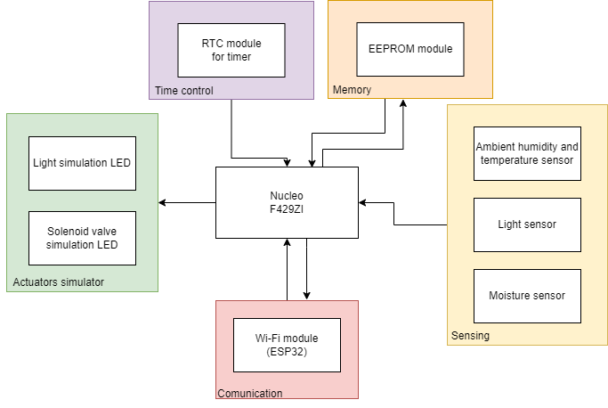

# eGardener

    

eGardener es un sistema de monitoreo y control de jardines a través de Internet implementado en mBed OS utilizando como placa de desarrollo una placa STM32 Nucleo-144 F429ZI.

El proyecto se realiza en el marco del trabajo final de la materia Sistemas Embebidos de la Facultad de Ingeniería de la Universidad de Buenos Aires.

[Repositorio](https://github.com/mati1297/egardener)

[Definición de Requisitos y Casos de Uso del Trabajo Final](https://docs.google.com/document/d/11dgvYxZRJ_eEkciaerqvtIlO_5C3YHUYF0_V8Po2s9I/edit?usp=sharing)

## Descripción y diagrama en bloques

eGardener provee sensado de temperatura, humedad ambiente y de la tierra y luz. Además, permite la activación de actuadores de luz y riego, incluyendo la lógica de control de los actuadores (no el control de los actuadores en sí). 

El sistema puede ser controlado a través de Internet utilizando un bot de la aplicación de mensajería Telegram. A través de este bot es posible interactuar con el dispositivo y obtener información del sensado de datos como también configurar aspectos del control y del sensado del jardín.

Es posible sensar los parámetros tanto manualmente como de manera regular. Y el control del jardín se realiza tanto de manera regular o en función de los parámetros sensados.

Se muestra en la Figura un diagrama en bloques del proyecto. Se observan tres grandes grupos de periféricos: comunicación, sensado, control de tiempo y simulación de actuadores. La primera consiste en un microcontrolador ESP32 utilizado como Módulo Wi-Fi a través de puerto serie. La segunda consiste en tres sensores: un sensor de humedad y temperatura ambiente (que se controla a través de I2C), un sensor de luz, y un sensor de humedad de tierra, el tercero consiste en un módulo RTC para poder llevar un control preciso del tiempo para las funciones por tiempo, el último consiste en dos leds que simularán el encendido de los actuadores.

    

## Organización del repositorio

El repositorio se organiza con la siguiente estructura

    .
    ├── docs
    │   ├── datasheets
    │   └── images
    ├── esp32_wifi
    ├── modules
    │   ├── aux_functions
    │   ├── clock
    │   ├── egardener
    │   ├── wifi
    │   └── ...
    ├── main.cpp
    ├── README.md
    └── ...

En donde se tienen las carpetas o archivos:
* `docs/`: carpeta que incluye documentos del proyecto, tales como *datasheets* de los componentes utilizados, e imágenes (utilizadas en este y otros documentos).
* `esp32_wifi/`: carpeta que contiene los archivos fuente utilizados para programar la placa ESP32 utilizada como módulo Wi-Fi y controlada a través de puerto serie.
* `modules/`: carpeta que contiene los archivos fuente de los distintos módulos que integran el programa del sistema.
* `main.cpp`: archivo principal del programa del sistema.
* `README.md`: este archivo *read me*.
* Otros archivos tales como licencia, archivos de configuración de mBed OS, etc.

## Manual de uso

### Conexión a PC

### Iniciar una conversación con el bot eGardener de Telegram

Teniendo la aplicación Telegram descargada en un teléfono movil o una computadora, se debe comenzar una conversación con el bot eGardener. Para ello, estando en la pantalla principal de Telegram, se debe aplicar en la lupa para buscar y se debe ingresar 'eGardener', se encontrará el bot con la imagen de perfil con el logo del proyecto. Ingresando al chat ya se puede comenzar a interactuar con el bot.

