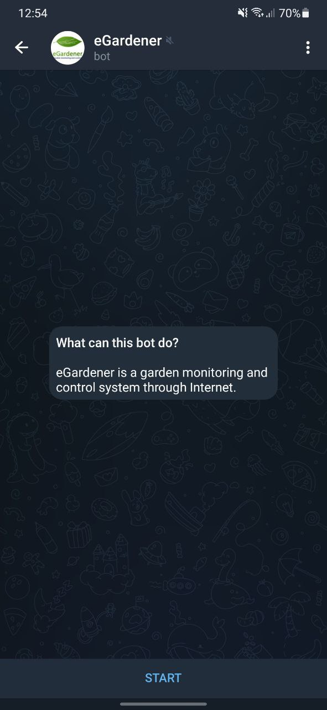
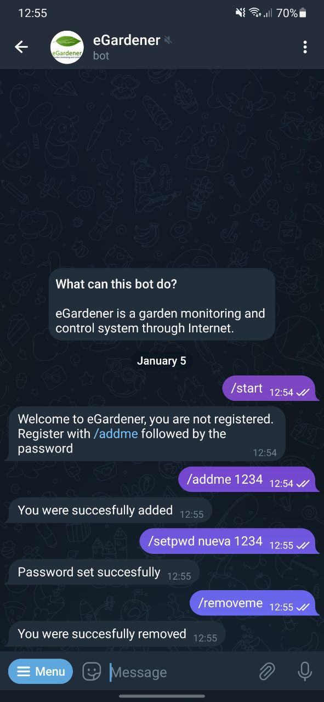
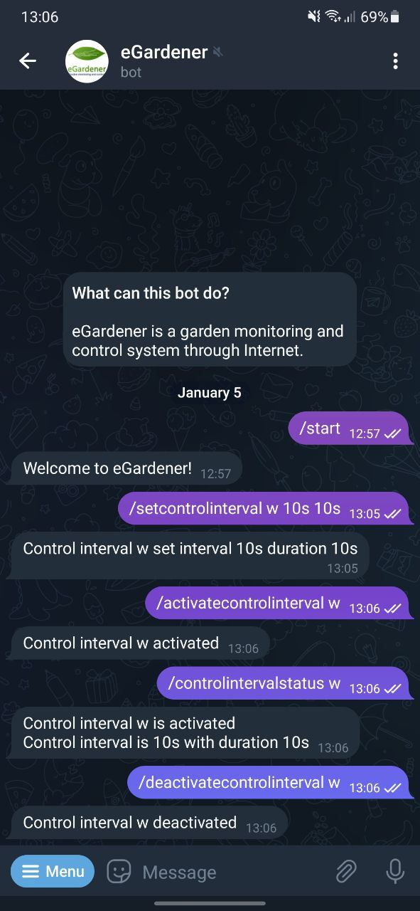

# eGardener

    

eGardener is a garden monitoring and control system through Internet implemented with mBed OS using a STM32 Nucleo-144 F429ZI development board.

This work is carried out within the framework of the Embedded Systems subject of the Faculty of Engineering of the University of Buenos Aires.

[Repository](https://github.com/mati1297/egardener)

[Memories and documentation (Spanish)](https://docs.google.com/document/d/1Q9U6rOzLBda17CwL__wQlIctoHDDly55YAzcOr6e88I/edit?usp=sharing)

[Requisites definition and use cases (Spanish)](https://docs.google.com/document/d/11dgvYxZRJ_eEkciaerqvtIlO_5C3YHUYF0_V8Po2s9I/edit?usp=sharing)

## Description and block diagram

eGardener provides temperature, ambient humidity, moisture and light sensing. In addition, it allows the activation of lighting and irrigation actuators, including only the actuator control logic (not the actuator control itself).

The system can be controlled over the Internet using a bot from the Telegram messaging application. Through this bot it is possible to interact with the device and obtain information on the data sensing as well as configure aspects of the control and sensing of the garden.

It is possible to sense the parameters both manually and on a regular basis. And the control of the garden is carried out both regularly or based on the parameters sensed.

A block diagram of the project is shown in Figure. Three large groups of peripherals are observed: communication, sensing, time control and actuator simulation. The first consists of an ESP32 microcontroller used as a Wi-Fi Module through a serial port. The second consists of three sensors: a room humidity and temperature sensor (which is controlled via I2C), a light sensor, and a ground humidity sensor, the third consists of an RTC module to be able to carry out precise control of the time for the functions by time, the last one consists of two leds that will simulate the activation of the actuators.

    

## Repository structure

The repository is structured in the following way

    .
    ├── docs
    │   ├── datasheets
    │   └── images
    ├── esp32_wifi
    ├── modules
    │   ├── aux_functions
    │   ├── clock
    │   ├── egardener
    │   ├── wifi
    │   └── ...
    ├── main.cpp
    ├── README.md
    └── ...

Where there are the folders or files:
* `docs/`: folder which includes projects documents, such as datasheets of the components and images (used in this and other documents).
* `esp32_wifi/`: folder that contains source files used for programming the ESP32 board used as Wi-Fi module and controlled through a serial port.
* `modules/`: folder which contains source files of the different modules which are part of the system program.
* `main.cpp`: main source file of the system program.
* `README.md`: this readme file.
* `README_es.md`: this readme file in Spanish.
* Other files such as license, mBed OS configuration files, etcetera.

## User manual

The steps to using the device through the Telegram bot are detailed here. In [Command Summary](#command-summary) the complete summary of the commands can be consulted with their specific use (variables, etc).

### PC Connection

To get started, both the NUCLEO board must be connected via USB to a computer or power supply as well as the ESP32 board. Once the NUCLEO board is connected, it will initialize and report it through the USB serial port. Information like the one in Figure will be seen and the password to register in the bot will be informed. In this case, the CoolTerm program is used.

    

### Start a conversation with the eGardener Telegram bot

Having the Telegram application downloaded on a mobile phone or a computer, a conversation with the eGardener bot should be started. To do this, being on the main Telegram screen, you must apply in the magnifying glass to search and enter 'eGardener', you will find the bot with the profile image with the logo of the project. Entering the chat you can start interacting with the bot.

    

### Conversation start and register

Once the chat is started, the `/start` command must be sent (which is mandatory since Telegram does not enable the chat until it is sent, and allows sending it with a button). At this point, the bot will reply with a welcome message and ask the user to register.

To register, you must send the command `/addme` followed by a space and the password, the password is given by USB serial port as shown in [Connection to PC](#pc-connection). Once the password is entered, you can start interacting.

The password can be changed using the `/setpwd` command, followed by a space and the new password, and then another space and the old password if any.

Registered users can be a maximum of four and will receive all auto sense notifications. To remove yourself from the registry you can use the `/removeme` command.

    

### Manual sensing

By manual sensing, variables can be sensed separately and all variables at the same time. This is done using the `/temperature`, `/humidity`, `/moisture`, `/light` and `/senseall` commands. The report also contains a timestamp with the time of the sensing.

    

### Manual control

To manually turn on a control (water or light), you must use the `/activatecontrol` command and the `/deactivatecontrol` command to turn it off. These commands must be followed by the letter `l` or `w` for light or water respectively.

To find out the power-on status of the control, you can use the `/controlstatus` command followed by the chosen control. It will be clarified if it is manually activated, if nothing is clarified, it is that it was turned on both by interval and by conditions (see [Control by time interval](#control-by-time-interval) and [Control by conditions]( #control-by-conditions)).

    

### Sensing by time interval

The sensing by time interval allows sensing from time to time all the variables. To do this you must set the time interval with `/setsenseinterval` followed by a space and the interval as time and then the unit (eg `12h` for 12 hours).

This sensing can be turned on and off with `/activatesenseinterval` and `/deactivatesenseinterval` respectively.

To check the status of the sense you can use `/senseintervalstatus`. Finally, you can check the next time the sense will be launched with `/nextsensetime`.

    

### Control by time interval

The control by time interval allows to activate from time to time and for a certain duration each control of the device (light and water). Each command specified in this section must be followed by the letter `l` or `w` for light or water respectively, and then followed by the necessary variables with a space in between (see the command summary for more information).

To set the control interval and duration, use the `/setcontrolinterval` command followed by the chosen control, the time interval with its unit (eg `12h` for 12 hours) and the control duration in the same format.

This control can be activated and deactivated with `/activatecontrolinterval` and `/deactivatecontrolinterval` respectively followed by the chosen control.

To check the status of the sense you can use `/controlintervalstatus` and to check the power-on status of the control you can use `/controlstatus`. Finally, you can check the next time the sense will be triggered with `/nextcontroltime`. All followed by the chosen control.

    

### Control by conditions

The control by conditions allows to activate each control of the device (light and water) according to the conditions of the variables sensed by the device. Each specific command in this section should be followed by the letter `l` or `w` for light or water respectively, and then followed by the necessary variables with a space in between (see the command summary for more information).

To configure the control conditions, the `/setcontrolcondition` command is used followed by the chosen control, and the conditions must be entered with their comparison sign and separated by a comma as `l < value, t > value`. The available signs are minor (`<`) and major (`>`) and the variables have letters representing the variables sensed (`t` for temperature, `l` for light, `m` for soil humidity (*moisture *) and `h` for ambient humidity). Conditions can be entered for only a few variables, there need not be one for each.

This control can be activated and deactivated with `/activatecontrolcondition` and `/deactivatecontrolcondition` respectively followed by the chosen control.

To check the status of the sensing you can use `/controlconditionstatus`. To check the power-on status of the control, use the `/controlstatus` command. Both followed by the chosen control.

    

### Command Summary

The following table shows a summary of the existing commands. These can also be consulted in the bot menu.

| Comando                     | Parámetros                           | Descripción                                                                                                                                                                                                                                         |
|-----------------------------|--------------------------------------|-----------------------------------------------------------------------------------------------------------------------------------------------------------------------------------------------------------------------------------------------------|
| /start                      | -                                    | Starts the bot.                                                                                                                                                                                                                                      |
| /setpwd                     | New password, old password   | Sets new password. If a password was set it must be entered.                                                                                                                                                                                      |
| /addme                      | password                           | Adds the user to the users registry. If a password is set must be entered.                                                                                                                                                                  |
| /removeme                   | -                                    | Deletes the user of the users registry.                                                                                                                                                                                                    |
| /temperature                | -                                    | Sends temperature value.                                                                                                                                                                                                                   |
| /humidity                   | -                                    | Sends ambient humidity value.                                                                                                                                                                                                              |
| /moisture                   | -                                    | Sends moisture value.                                                                                                                                                                                                             |
| /light                      | -                                    | Sends light value.                                                                                                                                                                                                                           |
| /senseall                   | -                                    | Sends all sensed variables value.                                                                                                                                                                                                    |
| /calibratelightsensor       | -                                    | Starts light sensor calibration.                                                                                                                                                                                                          |
| /calibratemoisturesensor    | -                                    | Starts moisture sensor calibration.                                                                                                                                                                                            |
| /activatesenseinterval      | -                                    | Activates sensing by interval.                                                                                                                                                                                                                  |
| /deactivatesenseinterval    | -                                    | Deactivates sensing by interval.                                                                                                                                                                                                                 |
| /setsenseinterval           | interval                            | Set sensing by interval. The interval is set as a number followed by its unit (s, m, h d).                                                                                                                                    |
| /senseintervalstatus        | -                                    | Sends the sensing by interval state.                                                                                                                                                                                                         |
| /nextsensetime              | -                                    | Sends the time of the next sense.                                                                                                                                                                                                                 |
| /activatecontrol            | control                              | Activates the control manually. The parameter could be w (water) or l (light).                                                                                                                                                                          |
| /deactivatecontrol          | control                              |  Deactivates the control manually. The parameter could be w (water) or l (light).                                                                                                                                                                        |
| /controlstatus              | control                              |  Sends control state. The parameter could be w (water) or l (light).                                                                                                                                                                             |
| /activatecontrolinterval    | control                              |  Activates control by interval. The parameter could be w (water) or l (light).                                                                                                                                                                        |
| /deactivatecontrolinterval  | control                              | Deactivates control by interval. The parameter could be w (water) or l (light).                                                                                                                                                                     |
| /setcontrolinterval         | control, interval, duration         | Set control interval and duration. The interval and duration are set as a number followed by its unit (s, m, h d).                                                                |
| /controlintervalstatus      | control                              | Sends control by interval state. The parameter could be w (water) or l (light).                                                                                                                                                              |
| /nextcontroltime            | control                              | Sends next time of activation. The parameter could be w (water) or l (light).                                                                                                                                                       |
| /activatecontrolcondition   | control                              | Activates control by conditions. The parameter could be w (water) or l (light).                                                                                                                                                                       |
| /deactivatecontrolcondition | control                              | Deactivates control by conditions. The parameter could be w (water) or l (light).                                                                                                                                                                    |
| /setcontrolcondition        | control, condition 1, condition 2, … | Set control turn on conditions. The control parameter could be w (water) or l (light). The conditions should be given with the variable to compare (l, m, t or h) followed by a sign (< or >) and then the value which is desired to compare. |
| /controlconditionstatus     | control                              | Sends the control by conditions state. The parameter could be w (water) or l (light).                                                                                                                                                             |

    

