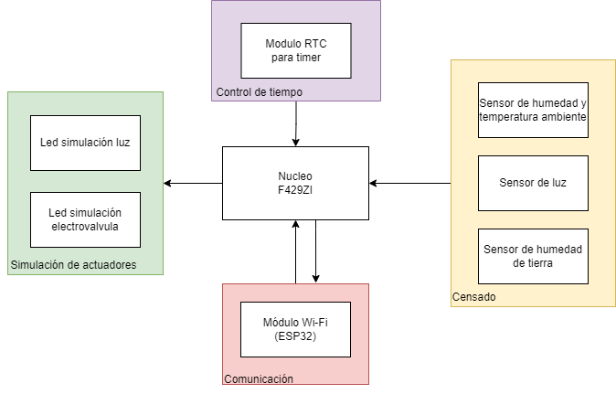
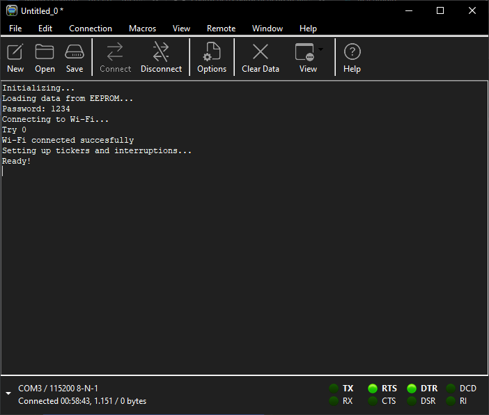
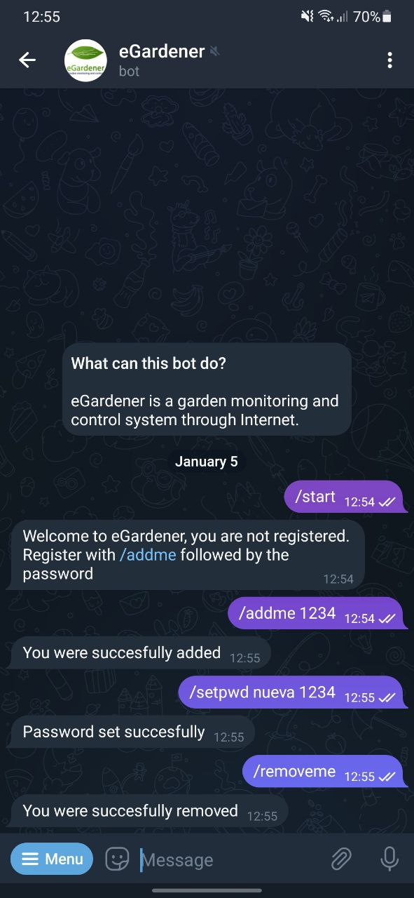
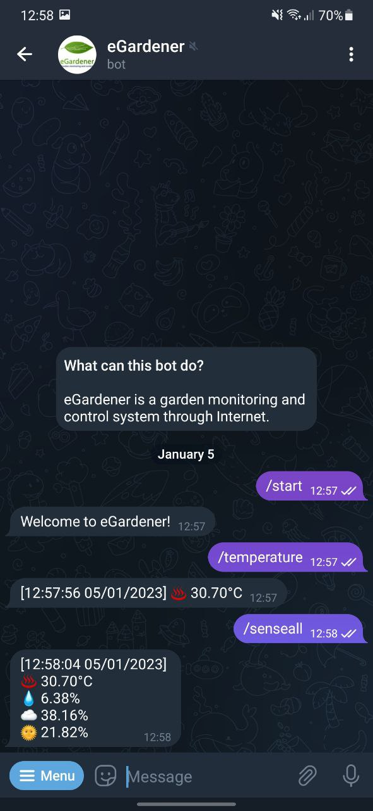
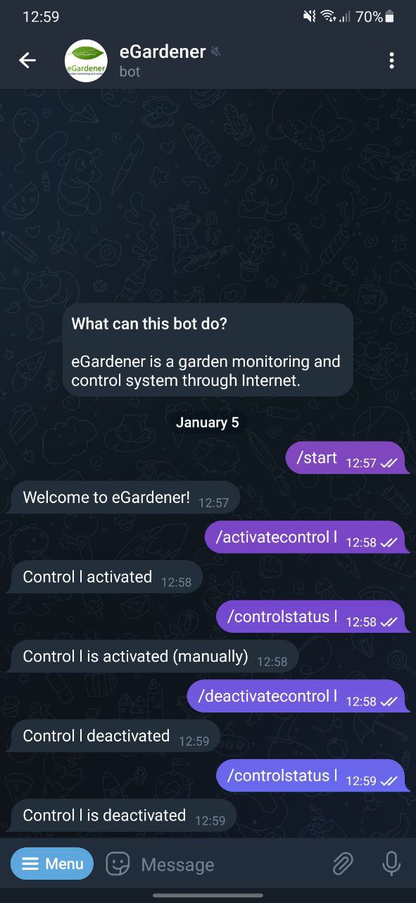
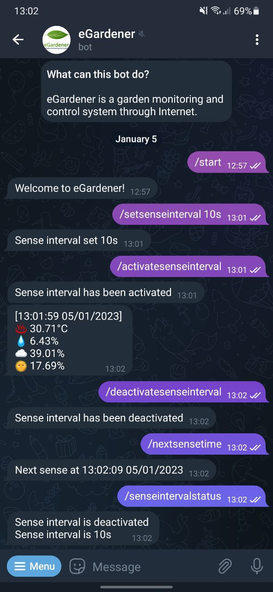
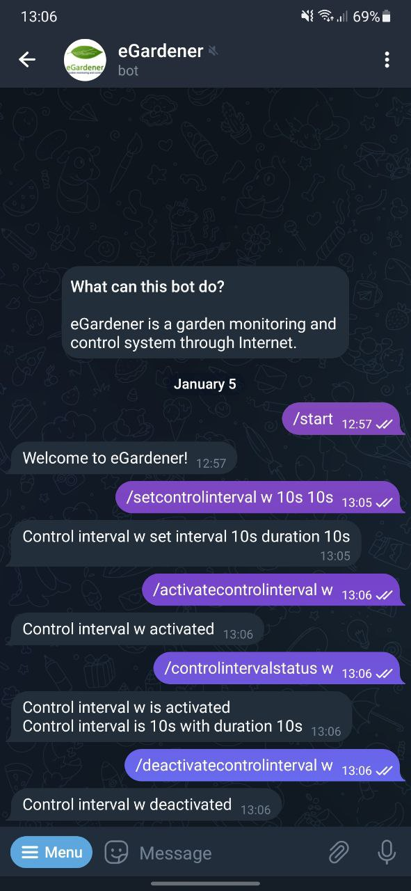
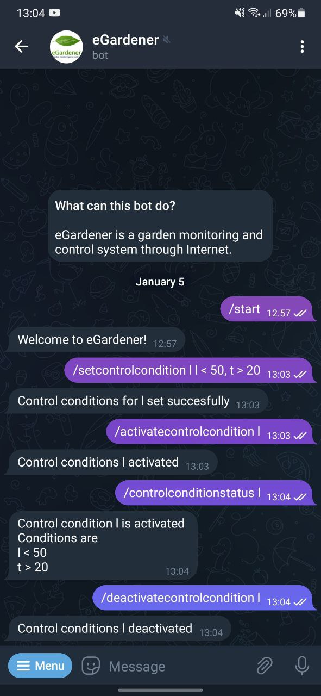
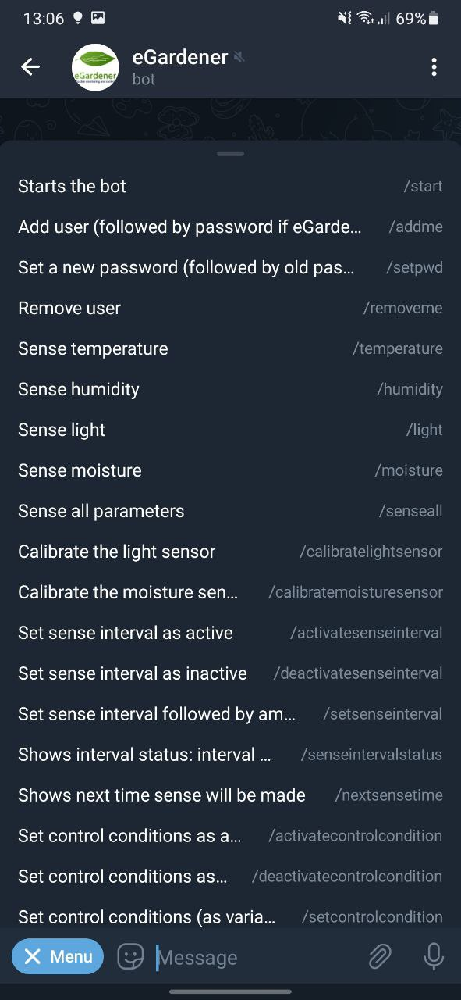

# eGardener

    

eGardener es un sistema de monitoreo y control de jardines a través de Internet implementado en mBed OS utilizando como placa de desarrollo una placa STM32 Nucleo-144 F429ZI.

El proyecto se realiza en el marco del trabajo final de la materia Sistemas Embebidos de la Facultad de Ingeniería de la Universidad de Buenos Aires.

eGardener is a garden monitoring and control system through Internet implemented with mBed OS using a STM32 Nucleo-144 F429ZI development board.

This work is carried out within the framework of the Embedded Systems subject of the Faculty of Engineering of the University of Buenos Aires.

[Repositorio](https://github.com/mati1297/egardener)

[Memorias y Documentación](https://docs.google.com/document/d/1Q9U6rOzLBda17CwL__wQlIctoHDDly55YAzcOr6e88I/edit?usp=sharing)

[Definición de Requisitos y Casos de Uso del Trabajo Final](https://docs.google.com/document/d/11dgvYxZRJ_eEkciaerqvtIlO_5C3YHUYF0_V8Po2s9I/edit?usp=sharing)

## Descripción y diagrama en bloques

eGardener provee sensado de temperatura, humedad ambiente y de la tierra y luz. Además, permite la activación de actuadores de luz y riego, incluyendo la lógica de control de los actuadores (no el control de los actuadores en sí). 

El sistema puede ser controlado a través de Internet utilizando un bot de la aplicación de mensajería Telegram. A través de este bot es posible interactuar con el dispositivo y obtener información del sensado de datos como también configurar aspectos del control y del sensado del jardín.

Es posible sensar los parámetros tanto manualmente como de manera regular. Y el control del jardín se realiza tanto de manera regular o en función de los parámetros sensados.

Se muestra en la Figura un diagrama en bloques del proyecto. Se observan tres grandes grupos de periféricos: comunicación, sensado, control de tiempo y simulación de actuadores. La primera consiste en un microcontrolador ESP32 utilizado como Módulo Wi-Fi a través de puerto serie. La segunda consiste en tres sensores: un sensor de humedad y temperatura ambiente (que se controla a través de I2C), un sensor de luz, y un sensor de humedad de tierra, el tercero consiste en un módulo RTC para poder llevar un control preciso del tiempo para las funciones por tiempo, el último consiste en dos leds que simularán el encendido de los actuadores.

    

## Organización del repositorio

El repositorio se organiza con la siguiente estructura

    .
    ├── docs
    │   ├── datasheets
    │   └── images
    ├── esp32_wifi
    ├── modules
    │   ├── aux_functions
    │   ├── clock
    │   ├── egardener
    │   ├── wifi
    │   └── ...
    ├── main.cpp
    ├── README.md
    └── ...

En donde se tienen las carpetas o archivos:
* `docs/`: carpeta que incluye documentos del proyecto, tales como *datasheets* de los componentes utilizados, e imágenes (utilizadas en este y otros documentos).
* `esp32_wifi/`: carpeta que contiene los archivos fuente utilizados para programar la placa ESP32 utilizada como módulo Wi-Fi y controlada a través de puerto serie.
* `modules/`: carpeta que contiene los archivos fuente de los distintos módulos que integran el programa del sistema.
* `main.cpp`: archivo principal del programa del sistema.
* `README.md`: este archivo *read me*.
* Otros archivos tales como licencia, archivos de configuración de mBed OS, etc.

## Manual de uso

Se detallan los pasos a seguir para la utilización del dispositivo a través del bot de Telegram. En [Resumen de comandos](#resumen-de-comandos) se encuentra el resumen de los comandos con su uso específico (con variables, etc).

### Conexión a PC

Para comenzar, se deben conectar tanto la placa NUCLEO por USB a una computadora o alimentación como también la placa ESP32. Una vez conectada la placa NUCLEO, esta se inicializará y lo informará a través de puerto serie USB. Se verá información como la de la Figura y se informará la contraseña para registrarse en el bot. En este caso se utiliza el programa CoolTerm.

    

### Iniciar una conversación con el bot eGardener de Telegram

Teniendo la aplicación Telegram descargada en un teléfono movil o una computadora, se debe comenzar una conversación con el bot eGardener. Para ello, estando en la pantalla principal de Telegram, se debe aplicar en la lupa para buscar y se debe ingresar 'eGardener', se encontrará el bot con la imagen de perfil con el logo del proyecto. Ingresando al chat ya se puede comenzar a interactuar con el bot.

    

### Comienzo de conversación y registro

Una vez iniciado el chat, se deberá enviar el comando `/start` (el cual es obligatorio ya que Telegram no habilita el chat hasta que se envie, y permite enviarlo con un botón). En este punto, el bot contestará con un mensaje de bienvenida y pedirá que el usuario se registre.

Para registrarse, se debe enviar el comando `/addme` seguido de un espacio y la contraseña, la contraseña es dada por puerto serie USB como se muestra en [Conexión a PC](#conexión-a-pc). Una vez ingresada la contraseña, se puede comenzar a interactuar.

La contraseña puede ser cambiada utilizando el comando `/setpwd`, seguido de un espacio y la contraseña nueva y luego otro espacio y la contraseña anterior si es que tenia. 

Los usuarios registrados pueden ser cuatro como máximo y recibirán todas las notificaciones de sensado automático. Para quitarse del registro se puede utilizar el comando `/removeme`.

    

### Sensado manual

Mediante sensado manual se pueden sensar las variables por separado y todas las variables al mismo tiempo. Para ello se utilizan los comandos `/temperature`, `/humidity`, `/moisture`, `/light` y `/senseall`. El reporte contiene además un *timestamp* con el tiempo del sensado.

    

### Control manual

Para encender manualmente un control (agua o luz), se debe utilizar el comando `/activatecontrol` y el comando `/deactivatecontrol` para apagarlo. Estos comandos deben ir seguidos por la letra `l` o `w` para luz o agua respectivamente.

Para conocer el estado de encendido del control, se puede utilizar el comando `/controlstatus` seguido del control elegido. De estar activado manualmente será aclarado, sino se aclara nada, es que se encendió tanto por intervalo como por condiciones (ver [Control por intervalo de tiempo](#control-por-intervalo-de-tiempo) y [Control por condiciones](#control-por-condiciones)).

    

### Sensado por intervalo de tiempo

El sensado por intervalo de tiempo permite sensar cada cierto tiempo todas las variables. Para ello se debe configurar el intervalo de tiempo con `/setsenseinterval` seguido de un espacio y el intervalo como tiempo y luego la unidad (por ejemplo `12h` para 12 horas).

Este sensado puede ser activado y desactivado con `/activatesenseinterval` y `/deactivatesenseinterval` respectivamente. 

Para chequear el estado del sensado se puede utilizar `/senseintervalstatus`. Por último, se puede chequear cual es el próximo tiempo en que se lanzará el sensado con `/nextsensetime`.

    

### Control por intervalo de tiempo

El control por intervalo de tiempo permite activar cada cierto tiempo y por una determinada duración cada control del dispositivo (luz y agua). Cada comando especificado en esta sección deberá ser seguido por la letra `l` o `w` para luz o agua respectivamente, y luego seguido de las variables necesarias con un espacio intermedio (ver el resumen de comandos para más información).

Para configurar el intervalo y la duración del control, se utiliza el comando `/setcontrolinterval` seguido del control elegido, el intervalo de tiempo con su unidad (por ejemplo `12h` para 12 horas) y la duración del control con el mismo formato.

Este control puede ser activado y desactivado con `/activatecontrolinterval` y `/deactivatecontrolinterval` respectivamente seguidos por el control elegido.

Para chequear el estado del sensado se puede utilizar `/controlintervalstatus` y para chequear el estado de encendido del control se utiliza `/controlstatus`. Por último, se puede chequear cual es el próximo tiempo en que se lanzará el sensado con `/nextcontroltime`. Todos seguidos por el control elegido.

    

### Control por condiciones

El control por condiciones permite activar cada control del dispositivo (luz y agua) según condiciones de las variables sensadas por el dispositivo. Cada comando específico de esta sección deberá ser seguido por la letra `l` o `w` para luz o agua respectivamente, y luego seguido de las variables necesarias con un espacio intermedio (ver el resumen de comandos para más información).

Para configurar las condiciones del control, se utiliza el comando `/setcontrolcondition` seguido del control elegido, y las condiciones, estas deben ser ingresadas con su signo de comparación y separadas por una coma como `l < valor, t > valor`. Los signos disponibles son menor (`<`) y mayor (`>`) y las variables tienen letras representativas de las variables sensadas (`t` para temperatura, `l` para luz, `m` para humedad de suelo (*moisture*) y `h` para humedad ambiente). Se pueden ingresar condiciones solo para algunas variables, no es necesario que haya una para cada una.

Este control puede ser activado y desactivado con `/activatecontrolcondition` y `/deactivatecontrolcondition` respectivamente seguidos por el control elegido.

Para chequear el estado del sensado se puede utilizar `/controlconditionstatus`. Para chequear el estado de encendido del control se utiliza el comando `/controlstatus`. Ambos seguidos del control elegido.

    

### Resumen de comandos

En la siguiente tabla se puede observar un resumen de los comandos existentes. Estos pueden ser consultados también en el menú del bot.

| Comando                     | Parámetros                           | Descripción                                                                                                                                                                                                                                         |
|-----------------------------|--------------------------------------|-----------------------------------------------------------------------------------------------------------------------------------------------------------------------------------------------------------------------------------------------------|
| /start                      | -                                    | Inicia el bot.                                                                                                                                                                                                                                      |
| /setpwd                     | nueva contraseña, vieja contraseña   | Configura una nueva contraseña. La anterior va si tuviera una.                                                                                                                                                                                      |
| /addme                      | contraseña                           | Agrega al usuario al registro de usuarios. Debe ponerse contraseña si tuviera una.                                                                                                                                                                  |
| /removeme                   | -                                    | Elimina al usuario del registro de usuarios.                                                                                                                                                                                                        |
| /temperature                | -                                    | Envía el valor de la temperatura.                                                                                                                                                                                                                   |
| /humidity                   | -                                    | Envía el valor de la humedad ambiente.                                                                                                                                                                                                              |
| /moisture                   | -                                    | Envía el valor de la humedad del suelo.                                                                                                                                                                                                             |
| /light                      | -                                    | Envía el valor de la luz.                                                                                                                                                                                                                           |
| /senseall                   | -                                    | Envía el valor de todos los parámetros sensados.                                                                                                                                                                                                    |
| /calibratelightsensor       | -                                    | Comienza el calibrado del sensor de luz.                                                                                                                                                                                                            |
| /calibratemoisturesensor    | -                                    | Comienza el calibrado del sensor de humedad del suelo.                                                                                                                                                                                              |
| /activatesenseinterval      | -                                    | Activa el sensado por intervalos.                                                                                                                                                                                                                   |
| /deactivatesenseinterval    | -                                    | Desactiva el sensado por intervalos                                                                                                                                                                                                                 |
| /setsenseinterval           | intervalo                            | Configura el intervalo entre sensado. El intervalo se establece como un número seguido de su unidad (s, m, h d).                                                                                                                                    |
| /senseintervalstatus        | -                                    | Envía el estado del sensado por intervalos.                                                                                                                                                                                                         |
| /nextsensetime              | -                                    | Envía la hora del próximo sensado.                                                                                                                                                                                                                  |
| /activatecontrol            | control                              | Activa manualmente el control. El parámetro puede ser w (agua) o l (luz).                                                                                                                                                                           |
| /deactivatecontrol          | control                              | Desactiva manualmente el control. El parámetro puede ser w (agua) o l (luz).                                                                                                                                                                        |
| /controlstatus              | control                              | Envía el estado del control. El parámetro puede ser w (agua) o l (luz).                                                                                                                                                                             |
| /activatecontrolinterval    | control                              | Activa el control por intervalos. El parámetro puede ser w (agua) o l (luz).                                                                                                                                                                        |
| /deactivatecontrolinterval  | control                              | Desactiva el control por intervalos. El parámetro puede ser w (agua) o l (luz).                                                                                                                                                                     |
| /setcontrolinterval         | control, intervalo, duración         | Configura el intervalo y la duración del control. El control puede ser w (agua) o l (luz). El intervalo y la duración se establecen como un número seguido de su unidad (s, m, h d).                                                                |
| /controlintervalstatus      | control                              | Envía el estado del control por intervalos. El parámetro puede ser w (agua) o l (luz).                                                                                                                                                              |
| /nextcontroltime            | control                              | Envía la hora de la próxima activación de control. El parámetro puede ser w (agua) o l (luz).                                                                                                                                                       |
| /activatecontrolcondition   | control                              | Activa el control por condiciones. El parámetro puede ser w (agua) o l (luz).                                                                                                                                                                       |
| /deactivatecontrolcondition | control                              | Desactiva el control por condiciones. El parámetro puede ser w (agua) o l (luz).                                                                                                                                                                    |
| /setcontrolcondition        | control, condicion 1, condicion 2, … | Configura las condiciones para el encendido. El parámetro control puede ser w (agua) o l (luz). Las condiciones deben ser dadas con la variable a comparar (l, m, t o h) seguido de un signo (< o >) y luego el valor con el que se desea comparar. |
| /controlconditionstatus     | control                              | Envía el estado del control por condiciones. El parámetro puede ser w (agua) o l (luz).                                                                                                                                                             |

    

